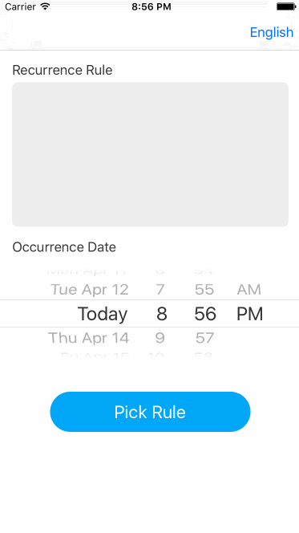

#RecurrencePicker
An event recurrence rule picker similar to iOS system calendar. 



##How To Get Started
###Carthage
Specify "RecurrencePicker" in your ```Cartfile```:
```ogdl 
github "teambition/RecurrencePicker"
```

###Usage
##### Import necessary frameworks
```swift
import RRuleSwift
import EventKit
import RecurrencePicker
```

#####  Initialization and Configuration
```swift
// prepare a recurrence rule and an occurrence date
// occurrence date is the date which the repeat event occurs this time
let recurrenceRule = ...
let occurrenceDate = ...

// initialization and configuration
// RecurrencePicker can be initialized with a recurrence rule or nil, nil means "never repeat"
let recurrencePicker = RecurrencePicker(recurrenceRule: recurrenceRule)
recurrencePicker.language = .English
recurrencePicker.calendar = NSCalendar.currentCalendar()
recurrencePicker.tintColor = UIColor.blueColor()
recurrencePicker.occurrenceDate = occurrenceDate

// assign delegate
recurrencePicker.delegate = self

// push to the picker scene
navigationController?.pushViewController(recurrencePicker, animated: true)
```

#####  Implement the delegate
```swift
func recurrencePicker(picker: RecurrencePicker, didPickRecurrence recurrenceRule: RecurrenceRule?) {
// do something, if recurrenceRule is nil, that means "never repeat".
}
```

## Minimum Requirement
iOS 8.0

##Dependency
RecurrencePicker's running requires [RRuleSwift](https://github.com/teambition/RRuleSwift).

##Localization
RecurrencePicker supports 5 languages: English, Simplified Chinese, Traditional Chinese, Korean, Japanese. You can set the language when initialization.

You can also get a localized rule text string like this:
```swift
let ruleString = "RRULE:FREQ=WEEKLY;INTERVAL=2;WKST=MO;DTSTART=20160413T133011Z;BYDAY=TU,WE,FR"
let recurrenceRule = RecurrenceRule(recurrenceWithRRuleString: ruleString)
let language: RecurrencePickerLanguage = ...
let recurrenceRuleText = recurrenceRule?.toText(language: language, occurrenceDate: NSDate())
print(recurrenceRuleText)
// Event will occur every 2 weeks on Tuesday, Wednesday and Friday.
// 事件将每2周于星期二、星期三和星期五重复一次。
// 行程每2週的星期二、星期三和星期五重複一次。
// 2주마다 화요일, 수요일 및 금요일에 이벤트 반복
// 2週間ごとに、火曜日、水曜日と金曜日にあるイベントです。
```

## Release Notes
* [Release Notes](https://github.com/teambition/RecurrencePicker/releases)

## License
RecurrencePicker is released under the MIT license. See [LICENSE](https://github.com/teambition/RecurrencePicker/blob/master/LICENSE.md) for details.

## More Info
Have a question? Please [open an issue](https://github.com/teambition/RecurrencePicker/issues/new)!
